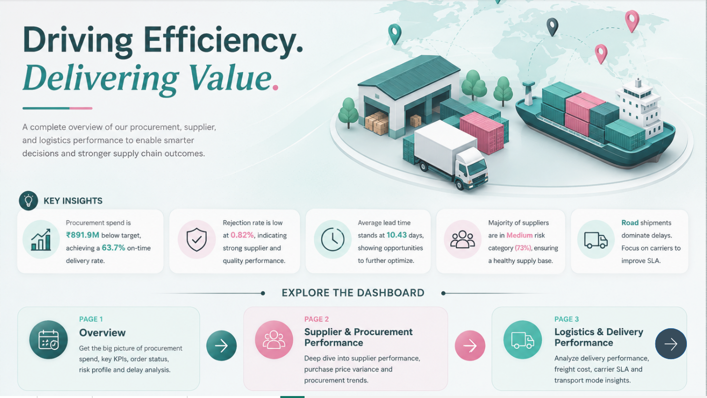
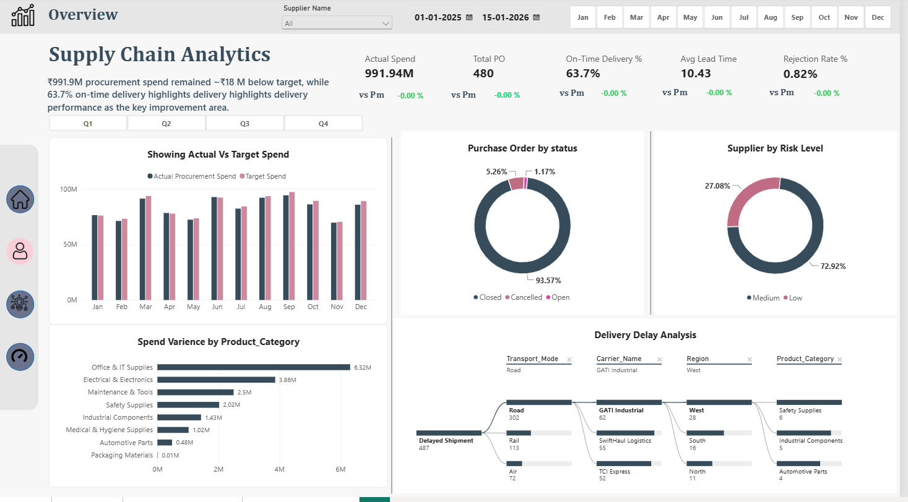
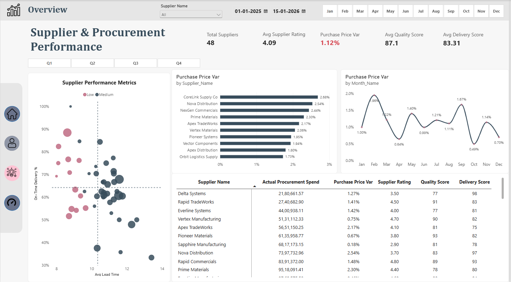
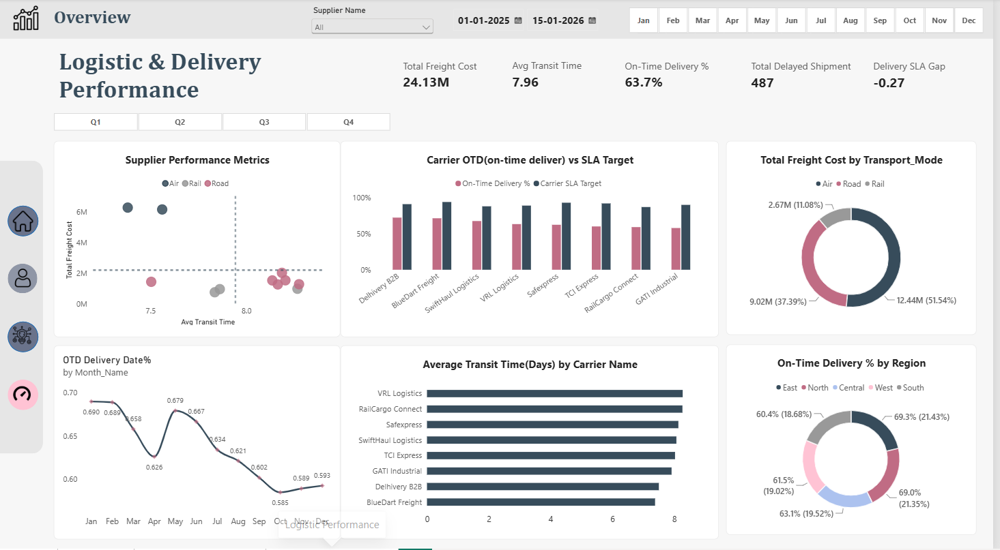

**Supply Chain Analytics Dashboard | Power BI**

Project Overview

This project is an interactive Supply Chain Analytics Dashboard built in Power BI to analyze procurement spend, supplier performance, purchase price variance, delivery efficiency, freight cost, and logistics performance.

Dashboard gives decision-makers single view of supply chain health and helps identify supplier risk, procurement variance, delayed shipments, carrier SLA gaps, and improvement opportunities.

Dashboard Home

Home page acts as navigation hub and summarizes major findings across procurement, supplier, and logistics analysis.

Key Insights

Procurement spend: ₹991.94M

On-Time Delivery: 63.7%

Rejection Rate: 0.82%

Average Lead Time: 10.43 days

Majority of suppliers fall under Medium Risk

Road transport contributes most delayed shipments

Page 1 — Supply Chain Overview

Overview page gives executive-level view of procurement and delivery performance.

KPIs

Actual Spend: ₹991.94M

Total Purchase Orders: 480

On-Time Delivery: 63.7%

Average Lead Time: 10.43 days

Rejection Rate: 0.82%

Analysis Included

Actual procurement spend vs target spend by month

Purchase order status distribution

Supplier risk-level distribution

Spend variance by product category

Delivery delay root-cause analysis by:

Transport Mode

Carrier

Region

Product Category

Month, quarter, supplier, and date filtering

Business Insight

Procurement spend remains close to target, while 63.7% on-time delivery shows delivery performance as major improvement area. Delay analysis helps trace delayed shipments from transport mode through carrier, region, and product category.

Page 2 — Supplier & Procurement Performance

This page focuses on supplier quality, procurement cost variance, lead time, and delivery reliability.

KPIs

Total Suppliers: 48

Average Supplier Rating: 4.09

Purchase Price Variance: 1.12%

Average Quality Score: 87.1

Average Delivery Score: 83.31

Analysis Included

Supplier performance segmentation using Average Lead Time vs On-Time Delivery %

Purchase Price Variance by supplier

Monthly Purchase Price Variance trend

Supplier-level procurement performance table

Actual Procurement Spend

Supplier Rating

Quality Score

Delivery Score

Business Insight

Page helps procurement teams identify suppliers with high price variance, long lead times, or weak delivery performance. Supplier scatter analysis makes strong and weak performers easier to spot for sourcing and negotiation decisions.

Page 3 — Logistics & Delivery Performance

This page analyzes transportation cost, transit time, carrier SLA performance, delayed shipments, and regional delivery performance.

KPIs

Total Freight Cost: 24.13M

Average Transit Time: 7.96 days

On-Time Delivery: 63.7%

Total Delayed Shipments: 487

Delivery SLA Gap: -0.27

Analysis Included

Freight Cost vs Average Transit Time by transport mode

Carrier On-Time Delivery vs SLA Target

Freight cost distribution by transport mode

Monthly On-Time Delivery trend

Average transit time by carrier

On-Time Delivery % by region

Business Insight

Air accounts for largest freight-cost share, while overall on-time delivery remains below desired SLA performance. Carrier comparison highlights where delivery reliability needs improvement, while transit-time and regional analysis help isolate logistics bottlenecks.

Dashboard Features

Interactive supplier slicer

Custom date-range filtering

Month and quarter navigation

Cross-filtering across visuals

KPI cards for executive monitoring

Supplier risk and performance segmentation

Procurement variance analysis

Carrier SLA comparison

Delivery delay root-cause analysis

Custom multi-page navigation

Business Questions Answered

Is procurement spend staying within target?

Which product categories drive highest spend variance?

Which suppliers have high purchase price variance?

Which suppliers combine strong delivery, quality, and ratings?

Which carriers are missing delivery SLA targets?

Which transport modes drive freight cost and shipment delays?

How does on-time delivery change month over month?

Which regions show weaker delivery performance?

Where should procurement and logistics teams focus improvement efforts?

Tools & Technologies

Power BI Desktop

Power Query — data cleaning and transformation

DAX — KPIs, measures, variance, and performance calculations

Data Modeling — relationships and analytical model design

Power BI Visualizations — KPI cards, scatter charts, bar charts, line charts, donut charts, decomposition analysis, tables, and slicers

Project Structure

Supply-Chain-Analytics/
│
├── README.md
├── Home.png
├── Overview.png
├── Supplier_Performance.png
├── Logistics_Performance.png
└── Supply_Chain_Analytics.pbix

Add your .pbix file to repository using filename Supply_Chain_Analytics.pbix, or update project structure with your actual filename.

Dashboard Navigation

Home → Overview → Supplier & Procurement Performance → Logistics & Delivery Performance

Dashboard uses dedicated navigation buttons to move between analytical pages while keeping design and filtering experience consistent.

Conclusion

Supply Chain Analytics Dashboard combines procurement, supplier, and logistics metrics into one decision-support solution. It highlights cost variance, supplier risk, delivery delays, carrier SLA performance, and freight efficiency so teams can quickly identify operational gaps and focus on measurable supply chain improvements.

Author

Suvajit Bera

Data Analytics | Business Intelligence | Power BI | SQL | Python
